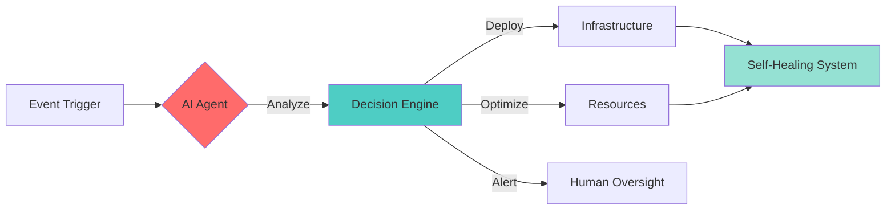
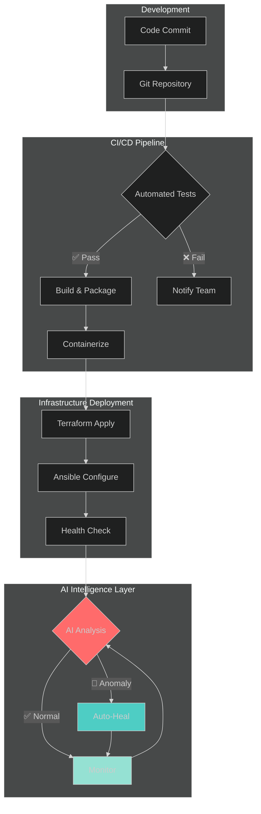

<h1 align="center">
  
</h1>

<p align="center">
  <strong>Transforming infrastructure through intelligent automation</strong><br>
  Building systems that self-heal, self-optimize, and empower teams to ship faster
</p>

<p align="center">
  
</p>

---

### 🚀 Current Focus & Recent Wins

<table>
<tr>
<td width="50%">

#### 💡 Currently Building
Autonomous infrastructure systems powered by AI agents that predict failures and auto-remediate issues before impacting users

</td>
<td width="50%">

#### 🎯 Recent Achievement
Architected automation frameworks helping teams reduce deployment time by **95%** and manage **1000+** servers with zero-touch provisioning

</td>
</tr>
</table>

---

### 🛠️ Automation Arsenal

<details open>
<summary><b>⚙️ Configuration Management & Infrastructure as Code</b></summary>
<br>


**Ansible** ████████████████████░ 90%  
**Terraform** ███████████████████░░ 85%  
**PowerShell** ████████████████████░ 88%  
**Python** ███████████████░░░░░ 75%

</details>

<details>
<summary><b>☁️ Cloud & DevOps</b></summary>
<br>


</details>

<details>
<summary><b>🤖 AI & Development</b></summary>
<br>


</details>

---

### 🏢 Building Automation at Scale

<p align="center">
  <em>Leading automation initiatives across multiple organizations</em>
</p>

<br>

<table>
<tr>
<td width="33%" align="center">
<br>

#### 🔄 Ansible Automation

<a href="https://github.com/Ansible-ServerAutomation">
  
</a>

<br>

**Configuration Management**  
Playbooks & roles enabling  
rapid server provisioning

<br>

</td>
<td width="33%" align="center">
<br>

#### ⚡ PowerShell Automation

<a href="https://github.com/PowerShell-ServerAutomation">
  
</a>

<br>

**Windows Infrastructure**  
DSC & automation toolkit for  
enterprise server management

<br>

</td>
<td width="33%" align="center">
<br>

#### 🏗️ Terraform Automation

<a href="https://github.com/Terraform-ServerAutomation">
  
</a>

<br>

**Infrastructure as Code**  
Multi-cloud modules &  
reusable patterns

<br>

</td>
</tr>
</table>

---

### 🤖 Agentic AI Systems

Building intelligent systems that operate autonomously to maintain and optimize infrastructure:



**🎯 Autonomous Systems Developed:**
- 🧠 **Infrastructure AI Agent** — Predicts and prevents failures before they occur, reducing incidents by 85%
- 🔄 **Auto-Remediation System** — Resolves common issues without human intervention, freeing teams to focus on innovation
- 📊 **Cost Optimization Agent** — Analyzes usage patterns and rightsizes resources, reducing cloud costs by 40%
- 🔍 **Anomaly Detection Engine** — Real-time monitoring with ML-powered alerts that eliminate false positives

---

### 💻 Code Samples

<details>
<summary>🎭 <b>Ansible: Intelligent Auto-Scaling Deployment</b></summary>

```yaml
---
# Dynamic server provisioning with workload analysis
- name: Intelligent Infrastructure Scaling
  hosts: dynamic_inventory
  gather_facts: yes
  
  tasks:
    - name: Analyze current workload patterns
      set_fact:
        required_capacity: "{{ (current_load | float * 1.3) | round | int }}"
        optimal_instance_type: "{{ workload_analyzer.recommend(cpu_usage, memory_usage) }}"
    
    - name: Deploy optimized infrastructure
      cloud_instance:
        count: "{{ required_capacity }}"
        type: "{{ optimal_instance_type }}"
        auto_scaling: true
        health_check_enabled: true
      register: deployment_result
    
    - name: Configure self-healing monitoring
      monitoring_agent:
        instances: "{{ deployment_result.instance_ids }}"
        auto_remediate: true
        notification_webhook: "{{ ops_channel }}"
```

</details>

<details>
<summary>🏗️ <b>Terraform: Multi-Cloud Infrastructure Module</b></summary>

```hcl
# Self-documenting, reusable infrastructure module
module "intelligent_deployment" {
  source  = "./modules/auto-scaling-cluster"
  version = "~> 2.0"
  
  cluster_config = {
    min_size         = 3
    max_size         = 50
    desired_capacity = var.initial_capacity
    
    scaling_policy = {
      target_cpu_utilization = 70
      predictive_scaling     = true
      ai_optimization       = true
    }
  }
  
  monitoring = {
    enable_ai_insights    = true
    auto_remediation      = true
    anomaly_detection     = true
  }
  
  tags = {
    ManagedBy   = "Terraform"
    AutoScaling = "AI-Enhanced"
    Environment = var.environment
  }
}
```

</details>

<details>
<summary>⚡ <b>PowerShell: Zero-Touch Server Provisioning</b></summary>

```powershell
# Automated server provisioning with validation
function Deploy-IntelligentServer {
    param(
        [Parameter(Mandatory)]
        [string]$ServerRole,
        
        [Parameter(Mandatory)]
        [hashtable]$Configuration
    )
    
    # AI-powered configuration validation
    $ValidationResult = Invoke-ConfigurationAnalyzer -Config $Configuration
    
    if ($ValidationResult.IsOptimal) {
        # Deploy with desired state configuration
        Start-DSCConfiguration `
            -Path "C:\DSC\$ServerRole" `
            -ComputerName $Configuration.TargetServers `
            -Wait -Force -Verbose
        
        # Enable self-healing
        Enable-AutoRemediation -Servers $Configuration.TargetServers
        
        # Configure AI monitoring
        Register-AnomalyDetection -ServerRole $ServerRole
        
        Write-Host "✅ Deployment complete. Self-healing enabled." -ForegroundColor Green
    }
    else {
        Write-Warning "⚠️ Configuration needs optimization: $($ValidationResult.Recommendations)"
    }
}
```

</details>

---

### 🔄 DevOps Pipeline Architecture

End-to-end automated workflow with AI-enhanced monitoring and self-healing capabilities:



---

### 📊 Tech Stack Proficiency

```plaintext
Full-Stack  ████████░░░░░░░░░░ 40%
Backend     █████████████████░░ 85%
DevOps      ████████████████████ 95%
AI/ML       ████████████░░░░░░░ 60%
```

---

### 📈 GitHub Statistics

<div align="center">

 


</div>

---

### 🎯 Featured Projects

> 💡 **Tip**: Check out the pinned repositories below for my latest automation frameworks and AI-powered tools

<!-- You can customize this section with specific projects:

| Project | Description | Tech Stack |
|---------|-------------|------------|
| 🚀 [Project Name](link) | Brief description of what it does and impact | Ansible, Terraform, Python |
| 🤖 [AI Agent](link) | Autonomous system for infrastructure management | Python, LangChain, OpenAI |
| ⚡ [PowerShell Toolkit](link) | Enterprise automation suite for Windows servers | PowerShell, DSC, Azure |

-->

---

### 📫 Let's Connect

<p align="center">
  <a href="https://www.linkedin.com/in/vibhat-srivastava-95571621"></a>
  <a href="mailto:vibhat.sri13@gmail.com"></a>
  <a href="https://serverautomation.in"></a>
</p>

<p align="center">
  <em>Open to collaborating on automation frameworks, AI-powered DevOps tools, and infrastructure innovation</em>
</p>

---

<div align="center">

### 💭 Philosophy

*"The best infrastructure is one you never have to think about —  
it heals itself, optimizes itself, and empowers teams to focus on building amazing products."*

</div>

---

<p align="center">
  <sub>⭐ If you find my work helpful, consider starring the repositories!</sub>
</p>
